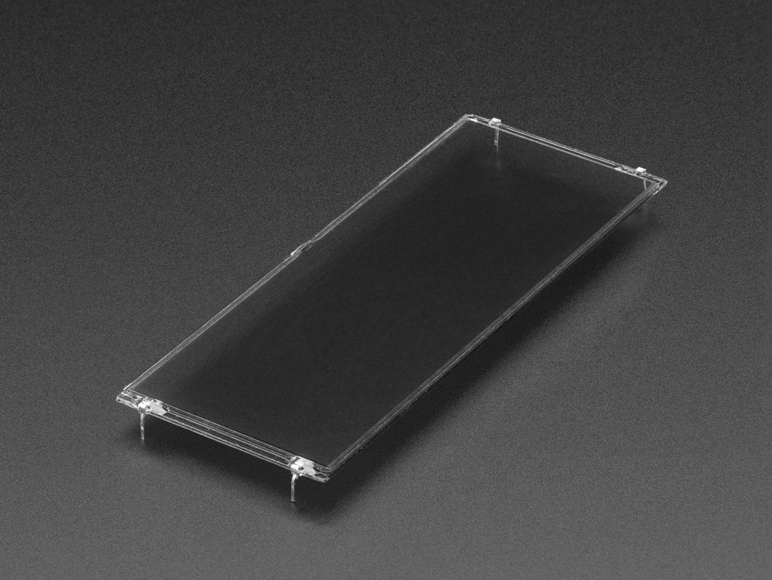
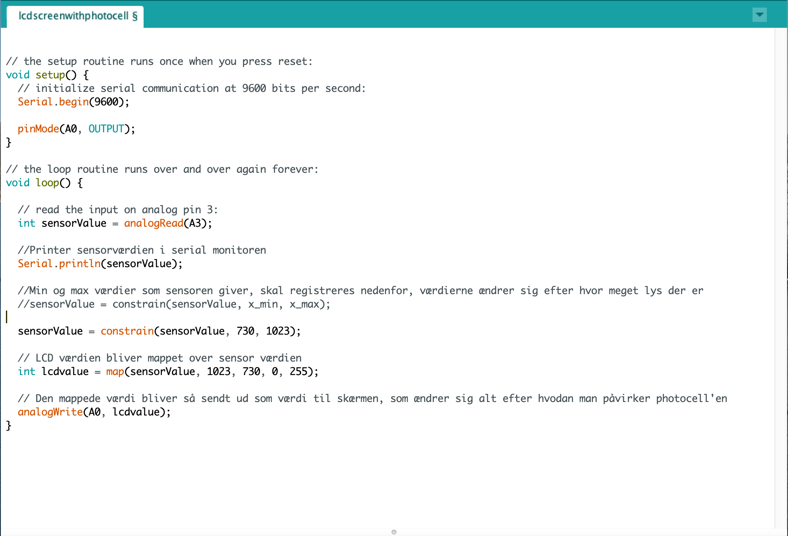

# Liquid-crystal-light-valve

[Link til adafruit page](https://www.adafruit.com/product/3330)

## Manual til at styre skærm med photocell:

Ved at bygge kredsløbet kan man styre gennemsigtigheden af skærmen ved at påvirke photocellen! 

For at lave kredsløbet skal de nødvendige dele først findes, står nedenfor. (Skærmen skal udleveres af en dd lab ansat)

### Materialer: 

1) Arduino circuit playground express board [Link til board](https://www.adafruit.com/product/3333) 
2) Photocell [Link til photocell](https://www.adafruit.com/product/161) 
3) Modstand til Photocell (Enten 5-10KΩ modstand eller 200KΩ modstand)
3) liquid display 

### Kredsløb

### Kode: 

Alt afhængig hvilket rum man befinder sig i, vil lyset være forskelligt som påvirker de værdier photocellen giver. Derfor skal man som det første registrere disse værdier i serial monitoren, for at tilegne minimum og maximum til rummet. 

I dette eksempel bruges en photocell til at påvirke gennemsigtigheden af skærmen. Photocell kan erstattes af forskellige spændingsdelere, så som potentiometer, temperatur sensor etc. 

 [Link til kode](https://github.com/DDlabAU/Liquid-crystal-light-valve)  
